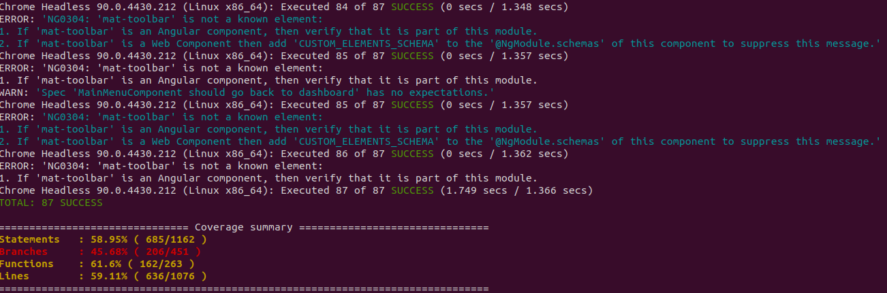
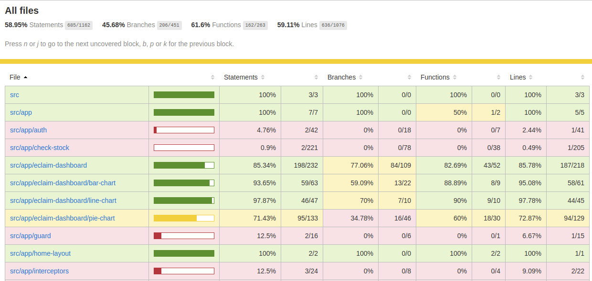

# Angular Unittest Docker
unitest angular on docker image

- support nodejs version 15.x
- support angular last version at 12.0.x



**Add line below into karma.conf.js**

```js
// Karma configuration file, see link for more information
// https://karma-runner.github.io/1.0/config/configuration-file.html

module.exports = function (config) {
  config.set({
    .
    .
    .
    
    customLaunchers: {
      'ChromeHeadless': {
        base: 'Chrome',
        flags: [
          '--no-sandbox',
          '--headless',
          '--disable-gpu',
          '--remote-debugging-port=9222'
        ]
      }
    }
  });
};

```

**Add line below into e2e/protractor.conf.js**

```js
// @ts-check
// Protractor configuration file, see link for more information
// https://github.com/angular/protractor/blob/master/lib/config.ts
.
.
.
exports.config = {

  .
  .
  .

  capabilities: {
    browserName: 'chrome',
    'chromeOptions': {
      'args': [
        '--no-sandbox',
        '--headless',
        '--window-size=1024,768'
      ]
    }
  },

  .
  .
  .

};
```

**How to Execute**

```sh
docker run -it --rm -v $PWD:/app kietara/angular-unittest:1.0.1 npm i&&ng test --code-coverage --browsers ChromeHeadless --watch=false
```

**Report at /coverage/projectname/**



